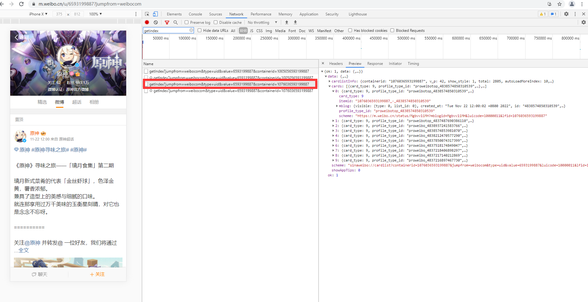
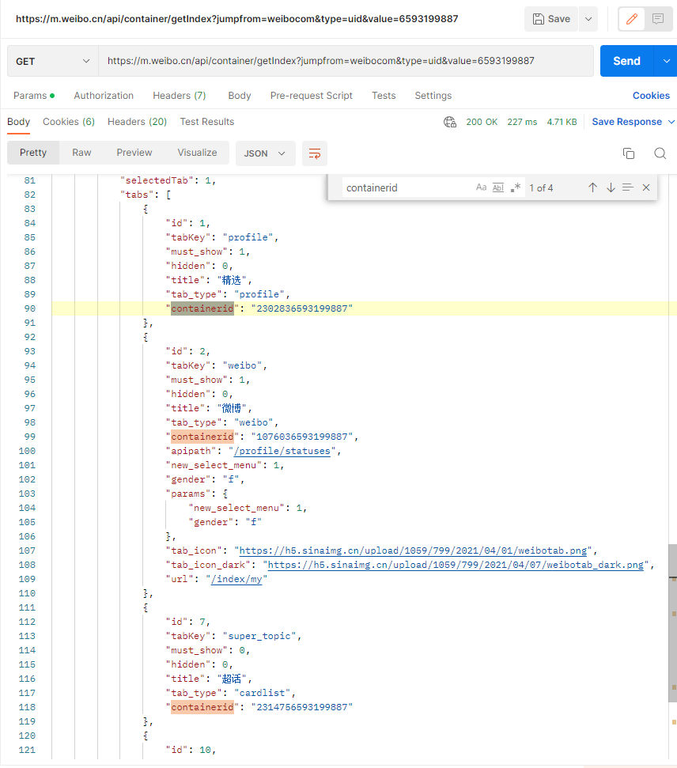

浏览器观察微博m站。可以比较清楚的获取到用户的博文列表为
https://m.weibo.cn/api/container/getIndex?jumpfrom=weibocom&type=uid&value=6593199887&containerid=1076036593199887

动态参数仅value和containerid两项。其中value可以看出是用户的uid。也就是说只要找到containerid的获取方式即可

postman尝试去掉containerid=1076036593199887

发现不同tab(精选/微博/超话/相册)下对应的containerid不同。尝试切换其他tab下的containerid。返回了对应tab下的内容。

翻页说明:
浏览器下滑模拟翻页。可以看到接口
https://m.weibo.cn/api/container/getIndex?jumpfrom=weibocom&type=uid&value=6593199887&containerid=1076036593199887&since_id=4837216389961467
相比之前仅多了一个since_id。不出意外 since_id 是上一页最后一个id。代码翻页时保留上一页最后一个id。拼接到请求即可